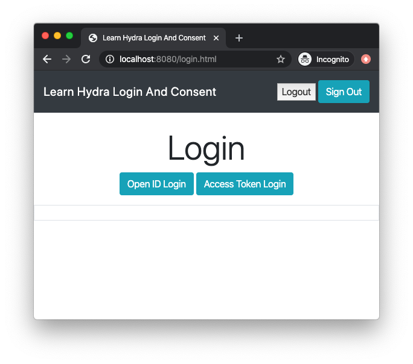
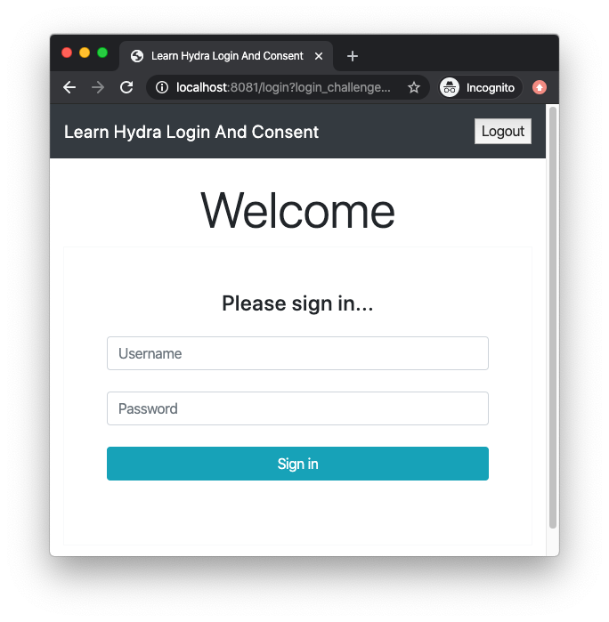
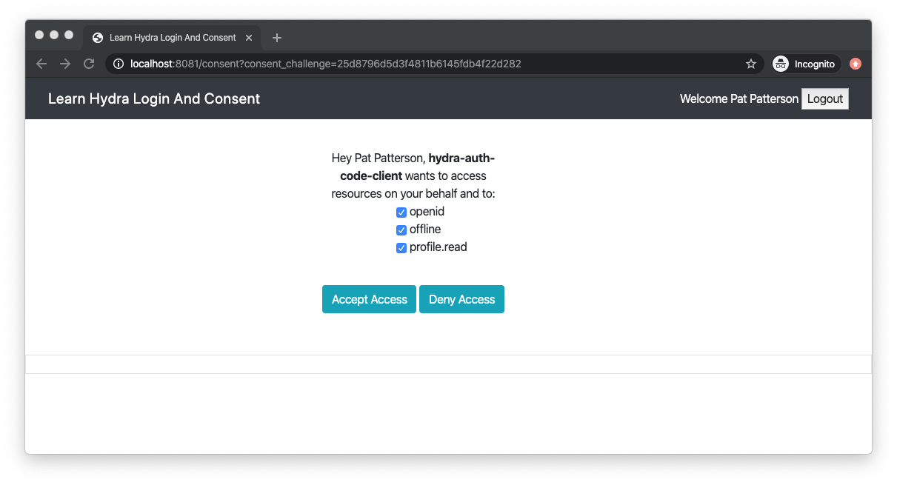
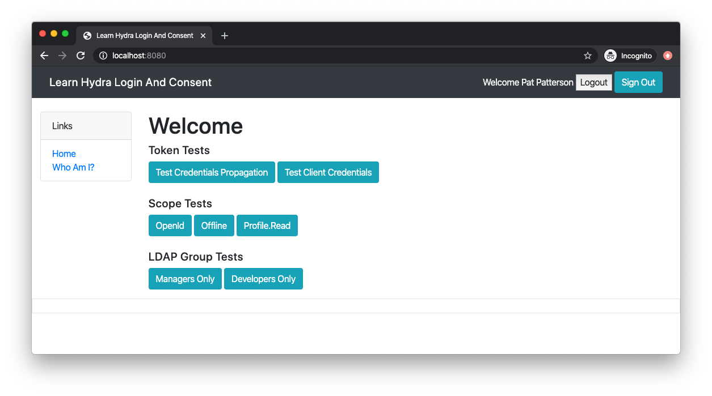

Learn Hydra Login And Consent
=============================

This project is my test project to learn OAuth2 from the perspective of application 
development.

In this project [Ory Hydra](https://www.ory.sh/docs/hydra/) is used as the OAuth2 provider
which means that one must implement
[Hydra's Login and Consent Flow](https://www.ory.sh/docs/hydra/oauth2#implementing-a-login--consent-provider).

In order to be more realistic, I wanted my users to be stored in an LDAP system.

Here is how the application works:

First the user would navigate to the `http://localhost:8080/` page and the application would 
redirect the user to a "pre-login" page to ask how the user wants to login:



Note that the user was redirected over to `http://localhost:8080/login.html`

Users would then choose between the OpenID login or the Access Token login. Once chosen, 
the user would then see a page to enter their username and password:



Note that the user was redirected over to `http://localhost:8081/login`

Here is a table of the test users:

|Username|   Password   |Role/Group|
|:-------|:------------:|---------:|
|pat     | patspassword |   Manager|
|alice   |alicespassword|   Manager|
|bob     | bobspassword | Developer|

If you want to add more users, just add them to this file:

```
learn-hydra-login-and-consent-ui/src/main/resources/people.ldif
```

After successfully logging in, the user needs to consent which scopes they want to 
grant to the token.



Once consented, you are now redirected to the home page:



Note that the user is back on `http://localhost:8080`

On this page, you can test your token to see what scopes and groups are granted on 
the token, and whether or not you can call another service. The results of the test 
show up in the URL (address bar).

## `learn-hydra-login-and-consent-ui`

This project is the Hydra Login and Consent UI application.

It is a Spring Boot Application, configured by default to run on port 8081.

Form based security, backed by an LDAP, is used to implement authentication.

### `FormBasedSecurityConfiguration` Configuration

The form based security configuration is this class. This is where the configuration 
exists to query groups and custom fields.

### `Hydra` Service

The `Hydra` service class have the details to communicate with the hydra service. This 
is where the magic occurs.

### `userinfo` Service

In order for the application to have a service to call, this application also includes 
a sample `userinfo` service. It is not necessary for the login flow, but I did not 
want to implement another service to run.

## `learn-hydra-login-and-consent-oauth-app`

This Spring Boot project is a very simple application that requires OAuth2 login.

The home page has buttons to test various aspects such as calling the `userinfo` service 
in the login and consent application.

## `learn-hydra-login-and-consent-shared`

Running all these applications on one system (i.e. your laptop) exposes a design constraint 
in that the web cookies will collide and the application will not work (i.e. you won't 
be able to log in). To resolve this issue, `Spring Session`, based by `Redis` is used.

Objects in the session (the UserDetails) are now shared between the applications and 
they need to share classes. That is why `ExtendedLdapUserDetailsMapper` is in the shared
project even though the OAuth application never really uses it.

## Build and Run (Docker Compose)

To build the application, run:

```
./mvnw clean install spring-boot:build-image
```

To fire up the application, run:

```
./deployments/docker-compose/start-spring-boot-login.sh
```

Before using the application, you need to create the two clients:

```
./deployments/docker-compose/create-auth-code-client.sh
./deployments/docker-compose/create-client-credentials-client.sh
```

Then you can navigate to:

```
http://localhost:8080
```

To see if the application is running, run:

```
./deployments/docker-compose/status.sh
```

To stop the application, run:

```
./deployments/docker-compose/stop-spring-boot-login.sh
```

## Development

If you want to work on the applications outside of docker, just comment out the configuration 
of the Spring Boot applications in this file (see comment at the end of the file):

```
./deployments/docker-compose/hydra-spring-boot-login.yml
```

## Comparison to ORY's foobar Version

If you want to use ORY's version of their Login and Consent Flow, just use these commands 
instead:

```
./deployments/docker-compose/start-ory-login.sh

./deployments/docker-compose/create-auth-code-client.sh
./deployments/docker-compose/create-client-credentials-client.sh

./deployments/docker-compose/status.sh
```

The login for this application is `foo@bar.com` just like the UI says. Note that the 
token tests won't work here because the service is not there, and the application will 
not have any of the LDAP information such as name and groups.

To stop the application, run:

```
./deployments/docker-compose/stop-ory-login.sh
```

## Utilities

There are more scripts in the deployment directory. They require that you have created 
the clients beforehand.

To get an access token using client credentials flow, run:

```
./deployments/docker-compose/get-access-token.sh
```

To inspect the token, run this:

```
./deployments/docker-compose/inspect-token.sh <PUT_TOKEN_HERE>
```

To use the Auth Code Flow, run this command, and follow the instructions the command 
give you (this might be broken):

```
./deployments/docker-compose/get-openid-token.sh
```

## TODO

There is more to work to do such as:

* Protect Actuator Endpoints
* Bug: Deny access behavior?
* Bug: Logout flow has never been tested. Where is the cookie?
* Add GlobalExceptionHandlers
* SessionManagement (Stateless Services)
* OAuth2 Audience
* Populate Standard OpenID fields
* Minikube Deployment
